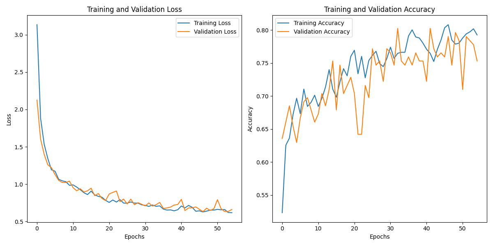

# Brain Page Navigator

## About
This project won **1st place** at the **Heroes of The Brain Hackathon** ([website](https://www.heroesofthebrain.pwr.edu.pl/)).  
It focuses on recognizing eye movement gestures using a **Convolutional Neural Network (CNN)** architecture. The goal is to develop an effective model that can interpret signals from an EEG headset, specifically identifying gestures such as **"Eye Down," "Eye Up,"** and **"No Movement."** 

### Applications:
- **Accessibility:** Assistive technologies for individuals with disabilities.
- **Neurofeedback & Cognitive Training:** Monitoring and enhancing brain activity.
- **Gaming & Virtual Reality:** Enabling immersive experiences.
- **Healthcare Monitoring:** Tracking cognitive health through brain activity.

---

## Installation

1. **Clone the repository:**
    ```sh
    git clone https://github.com/yourusername/brain-page-navigator.git
    ```
2. **Download required software:**
   - **BrainAccess Board:** [Download here](https://www.brainaccess.ai/software/brainaccess-board/).
   - **BrainAccess SDK:** [Download here](https://www.brainaccess.ai/software/brainaccess-sdk/).
   
   Copy the following files from the SDK into the project directory:
   - `bacore.dll`
   - `bacore.json`

3. **Connect hardware:**
   - Attach the **BrainAccess Standard Kit** to your computer.

4. **Run the application:**
    - **Main application:**  
      ```sh
      python page_scrolling.py
      ```
      
    - **Data collection and augmentation:**  
      ```sh
      python collect.py
      ```
    - **Training the CNN:**  
      ```sh
      python cnn.py
      ```
      

---
